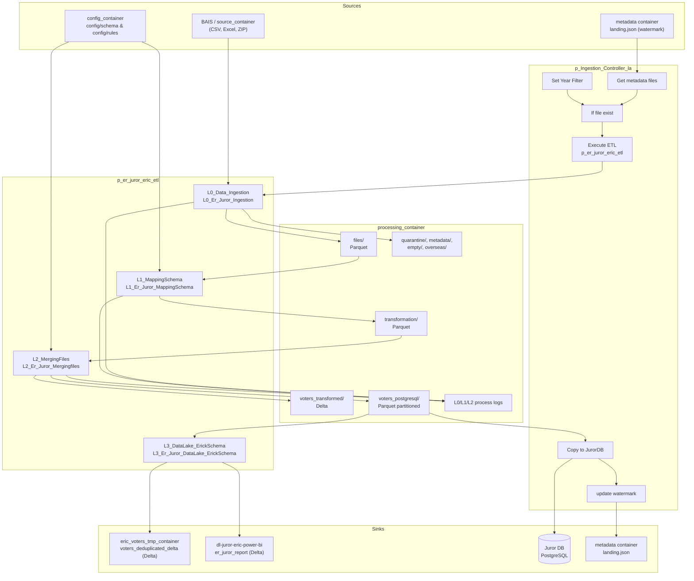
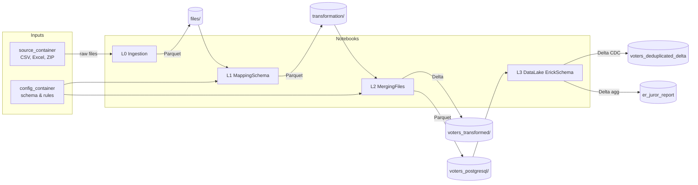
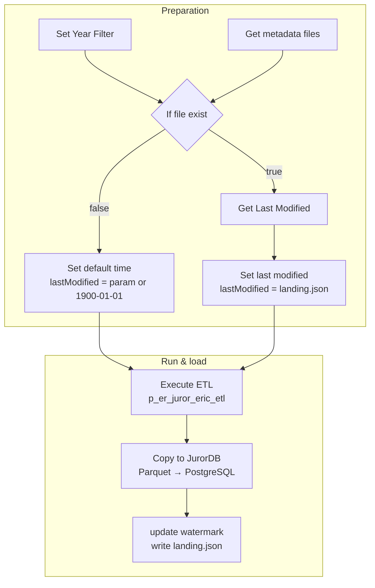

# Juror ER (Eric) — Data flow diagram

This document contains Mermaid diagrams for the **p_Ingestion_Controller_la** and **p_er_juror_eric_etl** pipelines. Render in any Markdown viewer that supports Mermaid (e.g. GitHub, Azure DevOps, VS Code with Mermaid extension).

---

## Gliffy format

A **Gliffy-native diagram** is provided for use in Gliffy (Confluence, Jira, Gliffy Online) or in draw.io (File → Import from → Device):

| File | Description |
|------|--------------|
| **[juror-er-data-flow.gliffy](juror-er-data-flow.gliffy)** | Data flow: Sources → ETL (L0–L3) → processing_container → Sinks. Left-to-right layout with labeled shapes. Open in Gliffy or import into draw.io; add connectors between shapes as needed. |

---

## 1. End-to-end data flow (ETL + controller)

Shows how data moves from source containers through the four ETL stages to Delta, PostgreSQL, and Power BI.

---

## 2. ETL pipeline only (data stores and notebooks)

Simplified view: data stores and the four notebooks in sequence.

---

## 3. Controller pipeline (activity flow)

Orchestration steps and how they connect to the ETL and Copy to JurorDB.

---

## 4. Container and path reference

| Symbol / path | Container | Description |
|---------------|-----------|-------------|
| source_container | (param) | Raw BAIS files (e.g. juror-la-landing). |
| processing_container | (param) | All intermediate and output paths below. |
| config_container | (param) | Column mapping and validation rules. |
| files/ | processing_container | L0 output Parquet. |
| transformation/ | processing_container | L1 output Parquet. |
| voters_transformed/ | processing_container | L2 Delta table. |
| voters_postgresql/ | processing_container | L2 Parquet for Copy to JurorDB. |
| voters_deduplicated_delta | eric_voters_tmp_container | L3 Delta (CDC). |
| er_juror_report | dl-juror-eric-power-bi | L3 aggregated Delta for Power BI. |
| metadata / landing.json | metadata | Watermark for incremental runs. |
