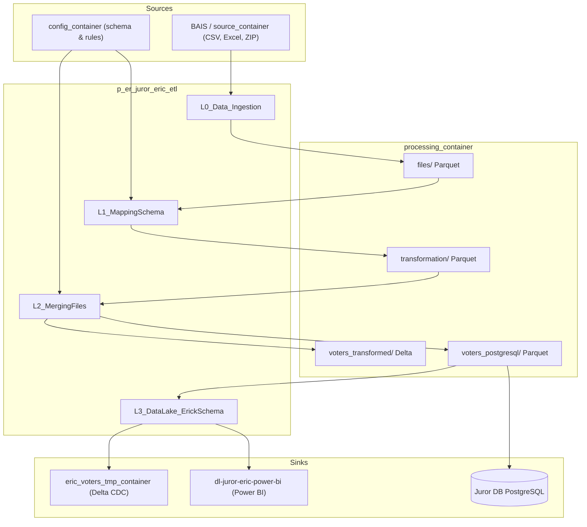

# p_er_juror_eric_etl — Pipeline Documentation

**Azure Synapse Pipeline**  
ETL pipeline for Juror ER (Eric) electoral roll data: ingestion → schema mapping → merge → Data Lake export with CDC. Invoked by `p_Ingestion_Controller_la`.

---

## Overview

| Property | Value |
|----------|--------|
| **Pipeline name** | `p_er_juror_eric_etl` |
| **Purpose** | Run the 4-stage ETL (L0 → L1 → L2 → L3) for juror electoral data |
| **Execution** | Sequential; each notebook depends on the previous one succeeding |

---

## Parameters

| Parameter | Type | Default | Description |
|-----------|------|---------|-------------|
| `source_container` | string | `juror-raw` | Container for raw/source files (e.g. from BAIS) |
| `year_filter` | string | `2025` | Year filter for processing |
| `processing_container` | string | `juror-etl` | Container for processed/intermediate data |
| `debug_mode` | bool | `true` | Enables debug behavior in L0 ingestion |
| `config_container` | string | `juror-etl` | Container for ETL config (column mapping, schema) |
| `eric_voters_tmp_container` | string | `dl-juror-eric-voters-temp` | Temp container for ERIC voters data (used in L3) |

---

## Execution Flow

```
L0_Data_Ingestion  →  L1_MappingSchema  →  L2_MergingFiles  →  L3_DataLake_ErickSchema
```

All activities use **Spark pool**: `sparkbaubais` (Small driver, Small executor).  
**Timeout** per activity: 12 hours. **Retry**: 0. **Snapshot**: true.

---

## Data flow diagram

End-to-end data flow from source containers through the ETL notebooks to Delta, PostgreSQL, and Power BI. More diagrams (controller flow, ETL-only, container reference) are in [data-flow-diagram.md](data-flow-diagram.md).



---

## Step 1: L0_Data_Ingestion

| Attribute | Value |
|-----------|--------|
| **Type** | Synapse Notebook |
| **Notebook** | `L0_Er_Juror_Ingestion` |
| **Depends on** | None |
| **Spark pool** | sparkbaubais (Small/Small) |

### Notebook parameters (from pipeline)

| Parameter | Expression |
|-----------|------------|
| `debug_mode` | `@pipeline().parameters.debug_mode` |
| `source_container` | `@pipeline().parameters.source_container` |
| `processing_container` | `@pipeline().parameters.processing_container` |
| `year_filter` | `@pipeline().parameters.year_filter` |

### Referenced notebook: L0_Er_Juror_Ingestion

**Purpose**  
ETL for juror-related files in Azure Data Lake Storage (ADLS): discover files, route them (quarantine/metadata/overseas), and convert to Parquet.

**Features**

- **File types**: CSV, Excel, ZIP.
- **Error handling**: Problematic files moved to quarantine.
- **Processing**: Apache Spark; reads/writes ADLS.
- **Metadata**: Adds metadata columns and maintains logs.

**Workflow (summary)**

1. **Initialization** — Logging and Spark session.
2. **File identification** — Detect CSV/Excel; detect metadata or empty files.
3. **File movement** — Move to quarantine, metadata, or overseas folders as needed.
4. **File processing** — Convert CSV/Excel to Parquet; merge by date and LA folder.
5. **Folder scanning** — Recursive scan for files to process.
6. **Logging** — Track operations and write logs to ADLS.

**Data input**

| Location | Container / path | Format | Description |
|----------|------------------|--------|-------------|
| Source | `source_container` (pipeline param, e.g. `juror-la-landing`) | CSV, Excel, ZIP | Raw juror files from BAIS; path under container is folder-based (e.g. date/LA structure). |
| — | — | — | Only files matching `year_filter` are processed. |

**Data output**

| Location | Container / path | Format | Description |
|----------|------------------|--------|-------------|
| Processed files | `processing_container` / `files/` | Parquet | Converted CSV/Excel; one Parquet per date+LA group; columns include `source_file`, `ingestion_date`. |
| Quarantine | `processing_container` / `quarantine/` | Original (CSV/Excel) | Unreadable or failed files. |
| Metadata | `processing_container` / `metadata/` | Original | Non-data files (e.g. readme). |
| Empty | `processing_container` / `empty/` | Original | Empty or header-only files. |
| Overseas | `processing_container` / `overseas/` | Original | Files with overseas address columns. |
| Logs | `processing_container` / `L0_process_log/` | JSON | `processed_files_log.json`, `quarantine_log.json`. |

**Key functions (from notebook)**

- `is_metadata_file(file_path)` — Whether file is metadata by name.
- `should_process_file(file_path)` — Whether to process (CSV or Excel).
- `is_empty_file(file_path)` — Empty or header-only check.
- `unzip_file(...)` — Extract ZIP and upload contents to ADLS.
- `process_file(...)` — Process CSV/Excel and write Parquet.
- `move_to_quarantine(...)` — Move failed/problem files to quarantine.

---

## Step 2: L1_MappingSchema

| Attribute | Value |
|-----------|--------|
| **Type** | Synapse Notebook |
| **Notebook** | `L1_Er_Juror_MappingSchema` |
| **Depends on** | L0_Data_Ingestion (Succeeded) |
| **Spark pool** | sparkbaubais (Small/Small) |

### Notebook parameters (from pipeline)

| Parameter | Expression |
|-----------|------------|
| `processing_container` | `@pipeline().parameters.processing_container` |
| `config_container` | `@pipeline().parameters.config_container` |

### Referenced notebook: L1_Er_Juror_MappingSchema

**Purpose**  
Electoral data ETL stage that enforces consistent schema, data quality, and column mapping using config from the config container. Reads L0 Parquet/Excel and writes standardized Parquet for L2.

**Data input**

| Location | Container / path | Format | Description |
|----------|------------------|--------|-------------|
| Processed files | `processing_container` / `files/` | Parquet, Excel | L0 output; notebook lists `.parquet`, `.xlsx`, `.xls`. |
| Column mapping | `config_container` / `config/schema` | JSON | Column mapping configuration (source → target names). |

**Data output**

| Location | Container / path | Format | Description |
|----------|------------------|--------|-------------|
| Transformed | `processing_container` / `transformation/` | Parquet | One file per source (e.g. `{date_folder}_{la_code}.parquet`); standardized schema. |
| Quarantine | `processing_container` / `L1_quarantine/` | Original | Files that failed read or transform. |
| Logs | `processing_container` / `L1_process_log/` | JSON, Parquet | `processed_files_log.json`, `processing_summary.json`; process log (Parquet) for incremental runs. |

**Features**

- **Standardization**: Consistent column names and formats via JSON mapping.
- **Error handling**: Logging and quarantine for bad files.
- **Spark**: Distributed processing; ADLS read/write.
- **Validation**: Required fields, types, and cleaning rules.

**Key areas (from notebook)**

- **Init & utils**: `create_spark_session()`, `ensure_folder_exists()`, `list_files()`, `get_folder_parts()`.
- **Config & mapping**: `read_column_mapping()`, `get_reverse_mapping()`, `standardize_column_names()`, `resolve_marker_columns()`.
- **Reading**: `read_excel_file()`, `read_file()` (Parquet/Excel).
- **Transformation**: `ensure_required_fields()`, `combine_name_components()`, `enhanced_split_elector_name()`, `extract_numeric_la_code()`, `clean_special_characters()`, `clean_character_data()`, `fix_numeric_fields()`, `process_name_components()`, `filter_records_with_empty_fields()`, `transform_data()`.
- **Output & logging**: `filter_to_required_columns()`, `move_to_quarantine()`, `process_file()`, processed-files log and process log updates, `get_new_files()`, `main()`.

---

## Step 3: L2_MergingFiles

| Attribute | Value |
|-----------|--------|
| **Type** | Synapse Notebook |
| **Notebook** | `L2_Er_Juror_Mergingfiles` |
| **Depends on** | L1_MappingSchema (Succeeded) |
| **Spark pool** | sparkbaubais (Small/Small) |

### Notebook parameters (from pipeline)

| Parameter | Expression |
|-----------|------------|
| `processing_container` | `@pipeline().parameters.processing_container` |
| `config_container` | `@pipeline().parameters.config_container` |

### Referenced notebook: L2_Er_Juror_Mergingfiles

**Purpose**  
Electoral roll ETL: read L1 output, merge multiple files, deduplicate, apply hashing and address logic, align to target schema, and write to Delta (and optionally prepare for PostgreSQL).

**Data input**

| Location | Container / path | Format | Description |
|----------|------------------|--------|-------------|
| Transformed | `processing_container` / `transformation/` | Parquet | L1 output; notebook discovers `.parquet` or directories with `_SUCCESS`. |
| Config | `config_container` / `config/schema` | JSON | Column mapping and schema config. |
| Rules | `config_container` / `config/rules/` | JSON | `validation_rules.json`, `validation_handlers.json`, `column_constraints.json`. |
| Process log | `processing_container` / `l2_process_logs/processed_files_log.txt` | Text | Pipe-separated log of already processed files (for incremental runs). |

**Data output**

| Location | Container / path | Format | Description |
|----------|------------------|--------|-------------|
| Delta (merged) | `processing_container` / `voters_transformed` | Delta | Merged, deduplicated, schema-aligned data; initial or incremental merge. |
| PostgreSQL load | `processing_container` / `voters_postgresql/creation_date_partition=*/` | Parquet | Partitioned by `creation_date_partition`; consumed by controller’s **Copy to JurorDB**. |
| Process log | `processing_container` / `l2_process_logs/processed_files_log.txt` | Text | Updated with processed file paths and status. |

**Features**

- **Config**: Column mapping and schema from config container; Delta Lake support.
- **Merging**: Combines DataFrames with schema variation handling.
- **Deduplication**: By creation date and by key fields (hash_id logic); window-based dedup.
- **Privacy**: Hashing of sensitive fields via `apply_hashing_to_voters()`.
- **Address**: `fix_address_fields()`, `comprehensive_address_validation()`.
- **Output**: Delta writes with initial/incremental handling; process log updates.

**Key areas (from notebook)**

- **Setup**: `configure_logging()`, `create_spark_session()` (Delta), `normalize_storage_path()`, `ensure_directory_exists()`, `load_config()`.
- **Schema**: `read_column_mapping()`, `standardize_columns()`, `ensure_register_poll_consistency()`, `read_schema_config()`, `ensure_consistent_schema()`.
- **Files**: `get_new_files()`, `process_input_files()`, `process_input_file_with_tracking()`.
- **Transform**: `merge_dataframes()`, `deduplicate_by_creation_date()`, `optimise_deduplicate_data()`, `improved_deduplicate_data()`, `generate_hash_id()`, `apply_hashing_to_voters()`, `fix_address_fields()`, `comprehensive_address_validation()`, `process_dataframe()`, `transform_to_target_schema()`.
- **Merge & write**: `merge_with_existing_data()`, `write_transformed_data_delta()`, `write_output_safely()`, `write_output_and_update_log()`, `update_enhanced_process_log()`.
- **PostgreSQL prep**: `prepare_postgresql_data()`.
- **Entry**: `main()` — full ETL orchestration.

---

## Step 4: L3_DataLake_ErickSchema

| Attribute | Value |
|-----------|--------|
| **Type** | Synapse Notebook |
| **Notebook** | `L3_Er_Juror_DataLake_ErickSchema` |
| **Depends on** | L2_MergingFiles (Succeeded) |
| **Spark pool** | sparkbaubais (Small/Small) |

### Notebook parameters (from pipeline)

| Parameter | Expression |
|-----------|------------|
| `processing_container` | `@pipeline().parameters.processing_container` |
| `config_container` | `@pipeline().parameters.config_container` |
| `eric_voters_tmp_container` | `@pipeline().parameters.eric_voters_tmp_container` |

### Referenced notebook: L3_Er_Juror_DataLake_ErickSchema

**Purpose**  
Export and manage voter data in the Data Lake using **Delta Lake** with **Change Data Capture (CDC)**: merge new data with existing Delta tables, enforce consistency and auditability, and produce an aggregated view for Power BI.

**Data input**

| Location | Container / path | Format | Description |
|----------|------------------|--------|-------------|
| PostgreSQL-ready | `processing_container` / `voters_postgresql` | Parquet | L2 output; voter records with `hash_id`, `creation_date`, etc. |

**Data output**

| Location | Container / path | Format | Description |
|----------|------------------|--------|-------------|
| Delta (CDC) | `eric_voters_tmp_container` / `voters_deduplicated_delta` | Delta | Full CDC-merged voter table; created on first run, merged on subsequent runs. |
| Power BI | `dl-juror-eric-power-bi` / `er_juror_report` | Delta | Aggregated by `creation_date` and `rec_num` for reporting. |
| Optional | (varies) | CSV | Discrepancy exports (e.g. records in Delta but not in PostgreSQL, or vice versa) for investigation. |

**Features**

- **CDC**: Merge new vs existing data on `hash_id`; audit columns; deduplication after merge.
- **Delta**: Full Delta Spark session; initial create or incremental merge.
- **Validation**: `hash_id` uniqueness and non-null checks.
- **Reporting**: Aggregated export for Power BI; discrepancy exports (Delta vs PostgreSQL) for investigation.

**Workflow (summary)**

1. **Initialization** — Logging; Spark with Delta extensions.
2. **Data export with CDC** — `export_voters_to_datalake_with_cdc()`:
   - Read source from ADLS; clean and deduplicate; validate `hash_id`.
   - If Delta table exists: read existing Delta, clean/dedup, full outer join on `hash_id`, apply CDC and audit columns, dedup, write back.
   - If not: add audit columns, dedup, write new Delta table.
   - Call `export_aggregated_data_for_powerbi()`.
3. **Aggregated export** — `export_aggregated_data_for_powerbi(delta_table_path)`: aggregate by `creation_date` and `rec_num`; write to Power BI Delta location.
4. **Main execution** — Run CDC export; load and verify Delta and Power BI outputs; print samples and summary stats.
5. **Post-export analysis** — Compare Delta vs PostgreSQL `hash_id`; export missing/extra records for investigation.

**Key functions**

- `export_voters_to_datalake_with_cdc()` — Main ETL and CDC merge logic.
- `export_aggregated_data_for_powerbi(delta_table_path)` — Power BI aggregation and write.

---

## Dependency Summary

| Step | Notebook | Depends on | Condition |
|------|----------|------------|-----------|
| 1 | L0_Er_Juror_Ingestion | — | — |
| 2 | L1_Er_Juror_MappingSchema | L0_Data_Ingestion | Succeeded |
| 3 | L2_Er_Juror_Mergingfiles | L1_MappingSchema | Succeeded |
| 4 | L3_Er_Juror_DataLake_ErickSchema | L2_MergingFiles | Succeeded |

---

## Referenced Notebooks Summary

| Pipeline activity | Notebook name | Role |
|-------------------|---------------|------|
| L0_Data_Ingestion | L0_Er_Juror_Ingestion | Ingest raw files (CSV/Excel/ZIP) from source container; convert to Parquet; quarantine/metadata handling. |
| L1_MappingSchema | L1_Er_Juror_MappingSchema | Apply column mapping and schema; clean and standardize; output Parquet for L2. |
| L2_MergingFiles | L2_Er_Juror_Mergingfiles | Merge files; deduplicate; hash sensitive data; validate addresses; write Delta and prepare for PostgreSQL. |
| L3_DataLake_ErickSchema | L3_Er_Juror_DataLake_ErickSchema | CDC merge into Delta; validate hash_id; export Power BI aggregation; optional Delta vs PostgreSQL comparison. |

---

## End-to-end data flow

| Stage | Data input | Data output |
|-------|------------|-------------|
| **L0** | `source_container`: CSV, Excel, ZIP (BAIS raw) | `processing_container/files/`: Parquet; quarantine/metadata/empty/overseas; L0_process_log |
| **L1** | `processing_container/files/`: Parquet, Excel; `config_container/config/schema`: mapping JSON | `processing_container/transformation/`: Parquet; L1_quarantine; L1_process_log |
| **L2** | `processing_container/transformation/`: Parquet; `config_container` schema & rules; L2 process log | `processing_container/voters_transformed`: Delta; `processing_container/voters_postgresql/`: Parquet (partitioned); L2 process log |
| **L3** | `processing_container/voters_postgresql`: Parquet | `eric_voters_tmp_container/voters_deduplicated_delta`: Delta; `dl-juror-eric-power-bi/er_juror_report`: Delta (aggregated); optional discrepancy CSVs |

---

## Notes

- **Spark pool**: All four notebooks use `sparkbaubais` (Small driver/executor). Notebook JSONs may specify larger driver/executor (e.g. 28g, 4 cores, 2 executors) when run interactively; pipeline uses pipeline-level pool settings.
- **Config**: Column mapping and schema come from `config_container` (default `juror-etl`); ensure the correct config files exist there.
- **Controller link**: This pipeline is invoked by `p_Ingestion_Controller_la`, which sets the watermark, runs this ETL, then runs **Copy to JurorDB** and **update watermark**.
